# 第 4 回課題

AWS コースの第 4 回課題が完了しましたので確認したいただけるとありがたいです。

## VPC 作成

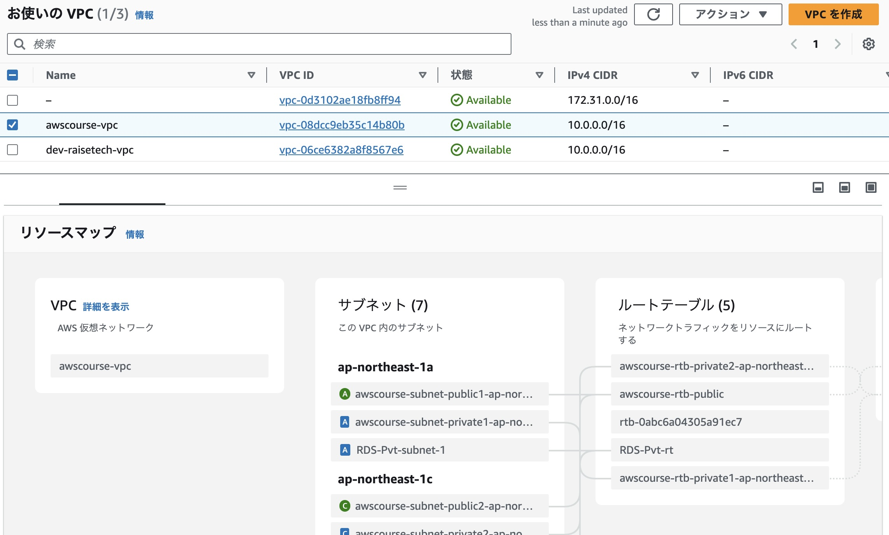

## EC2 インスタンス作成

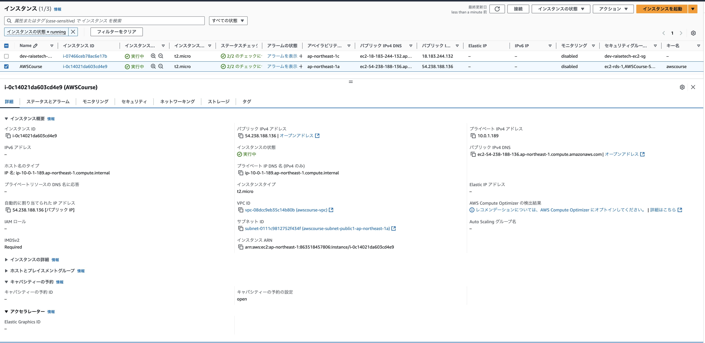

## RDS 作成

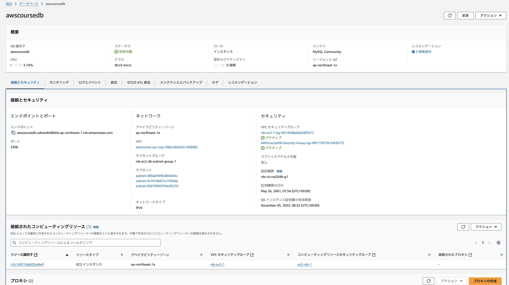

- RDS のサブネット

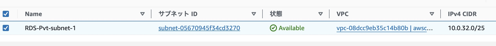

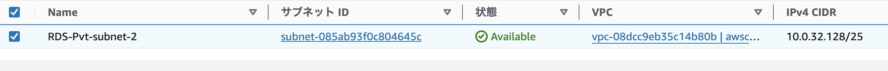

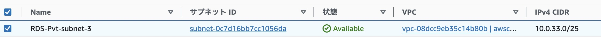

- サブネットにアタッチしているルートテーブルのエビデンス
  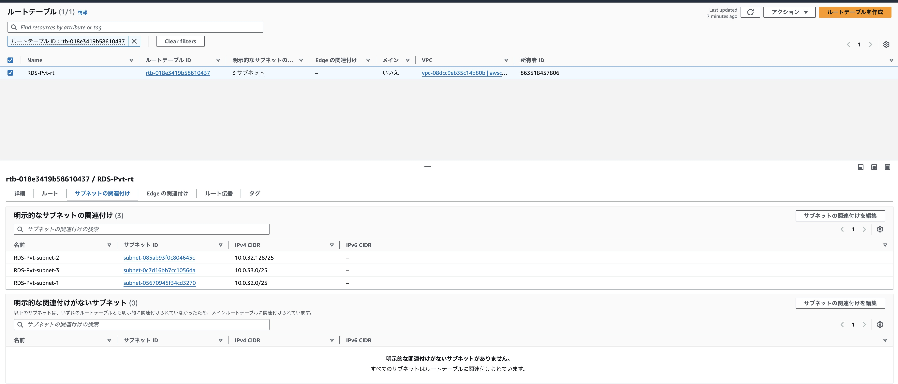

## EC2 のセキュリティグループ

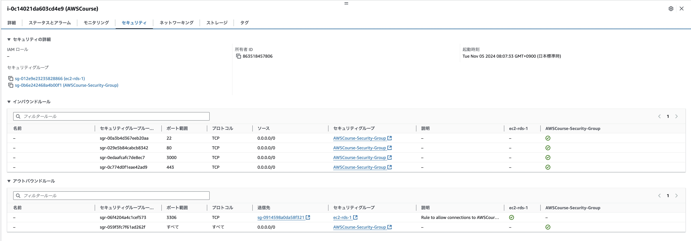

## RDS のセキュリティグループ

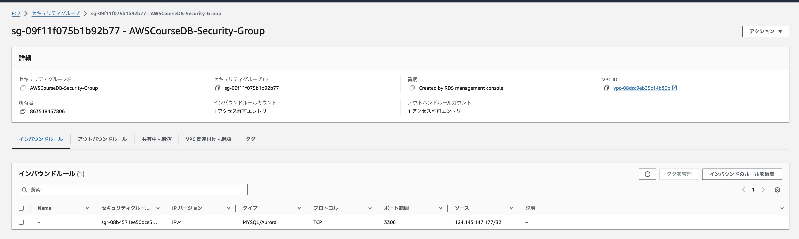

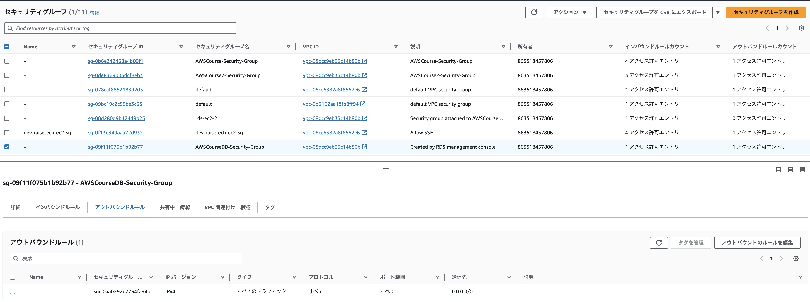

## EC2 から RDS に接続

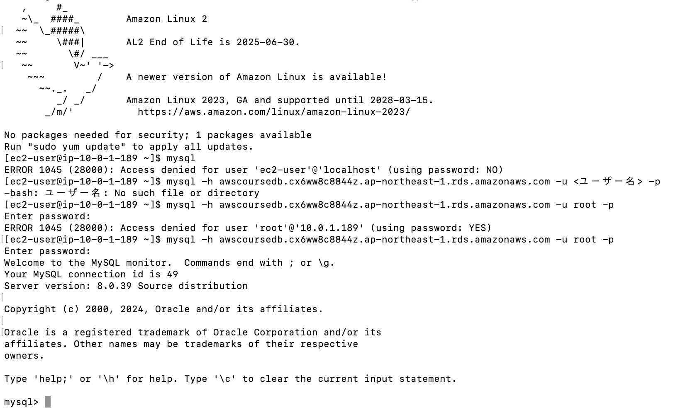
